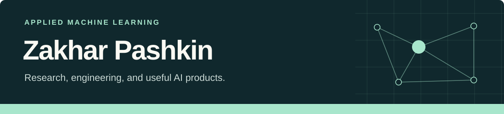

**Senior ML Engineer | Computer Vision, Document AI & Agentic Systems**

[Portfolio](https://zack-dev-cm.github.io/) · [Resume (PDF)](https://zack-dev-cm.github.io/resume/zakhar-pashkin-senior-ml-engineer.pdf) · [LinkedIn](https://www.linkedin.com/in/zakhar-pashkin-a524a6163/) · [Email](mailto:kaisenaiko@gmail.com)

I'm a Senior ML Engineer developing document intelligence and engineering-analysis workflows. My work connects models, evaluation and the software needed to use them. [Document AI](https://zack-dev-cm.github.io/projects/document-ai/)

## Packages & tools

- **Agnitra** — Python SDK and CLI for model profiling, runtime telemetry and inference optimization. [PyPI release](https://pypi.org/project/agnitra/) · [Engineering notes](https://zack-dev-cm.github.io/projects/agnitra-ml-profiling-optimization/)
- **CV Repro Lab** — Reproducible computer-vision experiments across Colab, Kaggle and GPU VMs, with benchmarks and reviewable run artifacts. [Source & examples](https://github.com/zack-dev-cm/agentic-cv-repro-lab-skill)
- **Artifact Redactor** — Redact sensitive text patterns from logs, Markdown and JSON; flag unsupported files for review. [Source & examples](https://github.com/zack-dev-cm/artifact-redactor)
- **[Vehicle Lab](https://github.com/zack-dev-cm/vehicle-lab)** — Open-source notebook for CAD inspection, design revisions and recorded simulation.

## Maintained service

**[Calorio](https://t.me/calorio_yf_bot) — AI meal logging in Telegram**

Built and maintain a service that helps people keep a food diary using meal photos, voice messages and text. I handle multimodal recognition, the logging workflow, deployment and technical support.

[Try the bot](https://t.me/calorio_yf_bot) · [Engineering case study](https://zack-dev-cm.github.io/projects/calorio-ai-nutrition-service/)

## Selected experience

- **Carb Manager** — Shipped food recognition and nutrition-label extraction across cloud, iOS and Android.
- **CFT** — Built financial-document recognition models, assisted annotation and mobile meter-recognition workflows.
- **Dermaself** — Developed guided capture, pore and wrinkle segmentation, and mobile/API integration for cosmetic skin analysis. [Case study](https://zack-dev-cm.github.io/projects/dermaself-flutter-skin-analysis-app/)
- **Video search** — Delivered ASR/OCR pipeline upgrades and Qdrant retrieval combining BM25 with dense embeddings. [Case study](https://zack-dev-cm.github.io/projects/multimodal-video-search-platform/)

[Full experience in the resume](https://zack-dev-cm.github.io/resume/zakhar-pashkin-senior-ml-engineer.pdf)

## Research in progress

- **[LigninQC](https://zack-dev-cm.github.io/projects/ligninqc-reproducible-scientific-research-workflows/)** — Literature-discovery and evidence-audit tooling for computational lignin research, with source provenance and publication-version grouping.
- **[Engineering analysis](https://zack-dev-cm.github.io/projects/engineering-drawing-cad-analysis/)** — Professional experience with computer vision for engineering drawings and 3D geometry; private company R&D.

## Tools I work with

- **Models:** Python · PyTorch · OpenCV · OpenMMLab · ONNX Runtime
- **Systems:** FastAPI · PostgreSQL · Qdrant · Docker · GCP · ClearML
- **Mobile:** Flutter · Dart · C++
