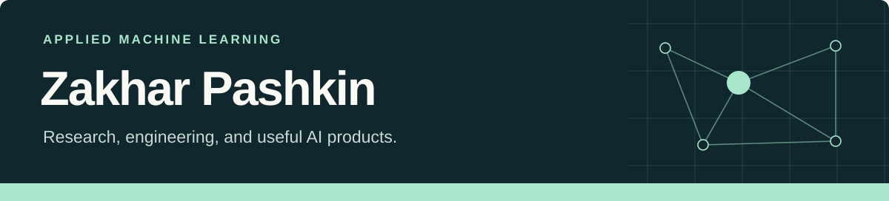

**ML engineer · computer vision, document AI & developer tools**

[Portfolio](https://zack-dev-cm.github.io/) · [LinkedIn](https://www.linkedin.com/in/zakhar-pashkin-a524a6163/) · [Email](mailto:kaisenaiko@gmail.com)

## Open-source contributions

- **Neuralink · datarepo** — Merged changes to query correctness, Python literals, credential refresh and packaging. **7 historical merges** · [#73](https://github.com/neuralinkcorp/datarepo/pull/73) [#74](https://github.com/neuralinkcorp/datarepo/pull/74) [#68](https://github.com/neuralinkcorp/datarepo/pull/68) [#67](https://github.com/neuralinkcorp/datarepo/pull/67) [#57](https://github.com/neuralinkcorp/datarepo/pull/57) [#58](https://github.com/neuralinkcorp/datarepo/pull/58) (later reverted) [#59](https://github.com/neuralinkcorp/datarepo/pull/59)
- **Tesla · Camera Kit** — Proposed fixes for Android scan accuracy, resource leaks and camera reuse. **4 open PRs** · [#812](https://github.com/teslamotors/react-native-camera-kit/pull/812) [#813](https://github.com/teslamotors/react-native-camera-kit/pull/813) [#817](https://github.com/teslamotors/react-native-camera-kit/pull/817) [#816](https://github.com/teslamotors/react-native-camera-kit/pull/816)
- **Unidata · netCDF4** — Merged fix for array dimensions when scientific-data selections are empty. **1 merged PR** · [#1499](https://github.com/Unidata/netcdf4-python/pull/1499) · [Interactive shape lesson](https://zack-dev-cm.github.io/docs/contribution-lab/)
- **Astropy · reproject** — Proposes rejecting undefined inverse coordinates; solar-reference behavior remains under review. **1 open PR** · [#630](https://github.com/astropy/reproject/pull/630) · [Playable coordinate lesson](https://zack-dev-cm.github.io/docs/contribution-lab/reproject.html)
- **LSST DESC · CCL** — Proposed FKEM integration-range and quadrature changes, pending numerical review. **1 open PR** · [#1310](https://github.com/LSSTDESC/CCL/pull/1310)
- **UNSW · Nempy** — Proposed corrections to battery dispatch inputs and Linux solver compatibility. **2 open PRs** · [#43](https://github.com/UNSW-CEEM/nempy/pull/43) [#44](https://github.com/UNSW-CEEM/nempy/pull/44)
- **pydicom · Display & modality lookup tables** — Proposed overflow fixes for display and modality lookup-table indexing. **2 open PRs** · [#2378](https://github.com/pydicom/pydicom/pull/2378) [#2379](https://github.com/pydicom/pydicom/pull/2379) · [Playable display lookup](https://zack-dev-cm.github.io/docs/contribution-lab/pydicom.html)
- **pydicom · Pixel encoding** — Proposed preservation of one-bit image pixels during compression. **1 open PR** · [#2380](https://github.com/pydicom/pydicom/pull/2380)
- **Unitree Robotics · Teleoperation & SDK** — Proposed teleoperation stop-call fix and DDS security documentation. **2 open PRs** · [#310](https://github.com/unitreerobotics/xr_teleoperate/pull/310) [#34](https://github.com/unitreerobotics/unitree_sdk2/pull/34)
- **Open CLIP · CoCa example in lucidrains’ fork** — Proposes a corrected model-factory call in the CoCa text-generation example. **1 open PR** · [#2](https://github.com/lucidrains/open_clip/pull/2)
- **OpenClaw · ClawPatch** — Fixes crawler access and adds website checks. **1 merged PR** · [#95](https://github.com/openclaw/clawpatch/pull/95)
- **Keras · Examples** — Adds missing setup dependencies for a documentation example. **1 merged PR** · [#520](https://github.com/keras-team/keras-io/pull/520)
- **Toloka · Python SDK** — Fixes the pool analytics code example. **1 merged PR** · [#55](https://github.com/Toloka/toloka-kit/pull/55)

Earlier merged contributions

- **Mobile marking detector · PyTorch Lite** — Updates Android inference to PyTorch Lite and its correct model loader. **2 merged PRs** · [#1](https://github.com/AndreyPetrovv/MobileDetectionOfSideFrameMarking/pull/1) [#2](https://github.com/AndreyPetrovv/MobileDetectionOfSideFrameMarking/pull/2)
- **CompTech · who-signed** — Adds Telegram photo intake and signature storage for a verification prototype. **2 merged PRs** · [#2](https://github.com/comptech-winter-school/who-signed/pull/2) [#3](https://github.com/comptech-winter-school/who-signed/pull/3)
- **Random Face · Colab setup** — Repairs model downloads and adds a runnable Colab entry point. **1 merged PR** · [#1](https://github.com/bes-dev/random_face/pull/1)
- **YParser · English documentation** — Makes image-collection setup and usage available in English. **1 merged PR** · [#1](https://github.com/asromahin/yparser/pull/1)

Status checked 9 October 2026. Datarepo #73/#74 and netCDF4 #1499 are merged but absent from the latest published artifacts checked on this date.

I work on computer vision, document intelligence and reproducible ML tools. Current R&D includes source-linked document review; Calorio is a maintained service. [Explore the work](https://zack-dev-cm.github.io/)

## Packages & tools

- **Agnitra** — Python SDK and CLI for model profiling, runtime telemetry and inference optimization. [PyPI release](https://pypi.org/project/agnitra/) · [Recorded profiling example in 3D](https://zack-dev-cm.github.io/docs/engineering-studies/studio.html?project=agnitra)
- **CV Repro Lab** — Reproducible computer-vision experiments across Colab, Kaggle and GPU VMs, with benchmarks and reviewable run artifacts. [Source & examples](https://github.com/zack-dev-cm/agentic-cv-repro-lab-skill)
- **Artifact Redactor** — Redacts sensitive text patterns from logs, Markdown and JSON; flags unsupported files for review. [Source & examples](https://github.com/zack-dev-cm/artifact-redactor)
- **[Vehicle Lab](https://github.com/zack-dev-cm/vehicle-lab)** — Open-source notebook for CAD inspection, design revisions and recorded simulation. [Interactive notebook](https://zack-dev-cm.github.io/docs/vehicle-lab/film.html)

## Maintained service

**[Calorio](https://t.me/calorio_yf_bot) — AI meal logging in Telegram**

I built and maintain a service that helps people keep a food diary using meal photos, voice messages and text. I handle multimodal recognition, the logging workflow, deployment and technical support.

[Try the bot](https://t.me/calorio_yf_bot) · [Engineering case study](https://zack-dev-cm.github.io/projects/calorio-ai-nutrition-service/)

## Selected experience

- **Riverstart · Jul 2026–present** — Document intelligence, source-linked specialist review and evaluation workflows for engineering documents. [Document AI](https://zack-dev-cm.github.io/projects/document-ai/)
- **Carb Manager** — Shipped food recognition and nutrition-label extraction across cloud, iOS and Android.
- **CFT** — Built financial-document recognition models, assisted annotation and mobile meter-recognition workflows.
- **Dermaself** — Developed guided capture, pore and wrinkle segmentation, and mobile/API integration for cosmetic skin analysis. [Case study](https://zack-dev-cm.github.io/projects/dermaself-flutter-skin-analysis-app/)
- **Video search** — Delivered ASR/OCR pipeline upgrades and Qdrant retrieval combining BM25 with dense embeddings. [Case study](https://zack-dev-cm.github.io/projects/multimodal-video-search-platform/)

[Full experience in the resume](https://zack-dev-cm.github.io/resume/zakhar-pashkin-senior-ml-engineer.pdf)

## Research & interactive work

- **[LigninQC](https://zack-dev-cm.github.io/projects/ligninqc-reproducible-scientific-research-workflows/)** — Rerun two published lignin-chemistry analyses offline, with source-linked tables, code and explicit limits.
- **[SectionCheck](https://github.com/zack-dev-cm/sectioncheck)** — Inspect affine image transforms and polygon regions, then export explicit review decisions using synthetic images. [Explore in 3D](https://zack-dev-cm.github.io/docs/neural-engineering/studio.html?project=sectioncheck)
- **[Drawing → catalog → interior](https://zack-dev-cm.github.io/docs/architectural-catalog/)** — Follow an eight-stage recorded workflow and inspect adjustable room fit. The guide and film are available; live generation is paused.
- **[Engineering analysis](https://zack-dev-cm.github.io/projects/engineering-drawing-cad-analysis/)** — Professional experience with computer vision for engineering drawings and 3D geometry; private company R&D.

## Tools I work with

- **ML & vision:** Python · PyTorch · OpenCV · OpenMMLab · ONNX Runtime
- **Systems:** FastAPI · PostgreSQL · Qdrant · Docker · GCP · ClearML
- **Mobile:** Flutter · Dart · C++
